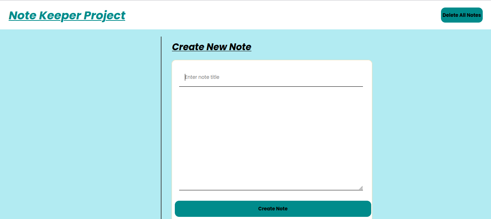
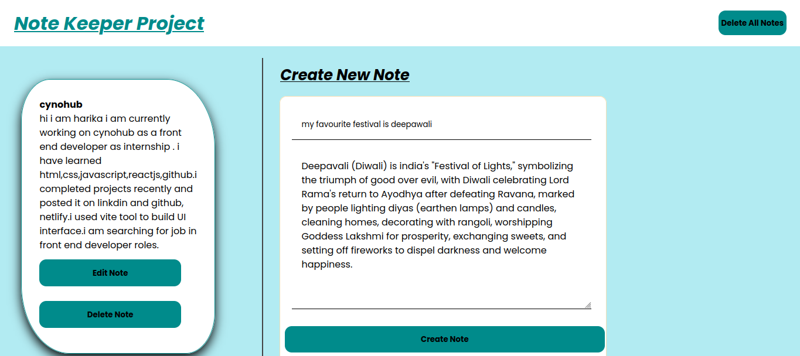
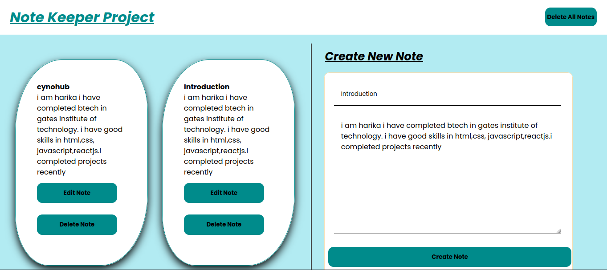
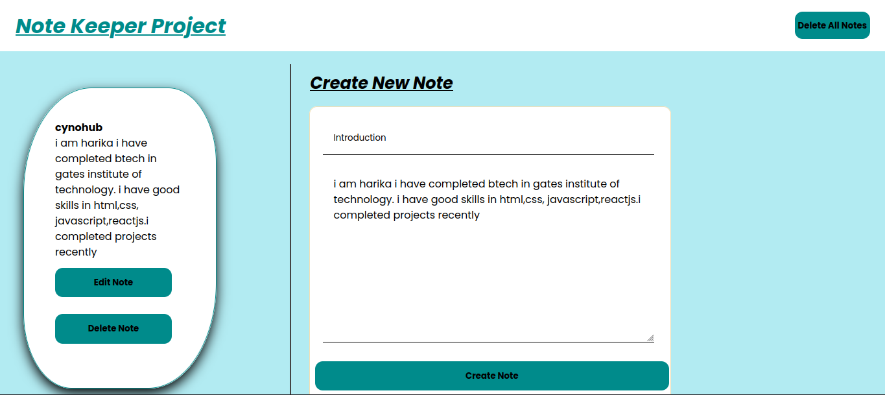

# 📝 NoteVault – Notes Keeping Web App

A simple, fast, and responsive notes-keeping web application built using **Vanilla JavaScript** and **Vite**.

This project showcases my frontend fundamentals, clean code practices, and experience with modern build tools.

---

## 🚀 Live Preview
🎥 **Project Demo Video:**  
👉 *(https://github.com/user-attachments/assets/115d4578-c895-4ad1-84a3-4b23a28a452f)*

---

## 📸 Screenshots

### 🖥️ Home Page


### ➕ Create Note


### Edit Note


### 🗑️ Delete Notes


> 📌 Create a folder named **screenshots/** in your project root and place images there.

---

## ✨ Features
- Create, edit, and delete notes  
- Input validation (prevents empty notes)  
- Persistent data storage using **Browser Local Storage**  
- Fast development server and optimized build using **Vite**  
- Clean and user-friendly UI  

---

## 🛠 Tech Stack
- HTML5  
- CSS3  
- JavaScript (ES6)  
- **Vite** (Modern frontend build tool)

---

## 📂 Project Structure
```

notevault/

├── src/
│   ├── main.js
│   
│   
├── screenshots/
│   ├── homepage.png
│   ├── createnotepage.png
│   ├── editpage.png
│   └── deletepage.png
├── index.html
├── package.json
└── README.md

````

---

## ⚙️ Getting Started

### 1️⃣ Clone the repository
```bash
git clone https://github.com/your-username/notevault.git
cd notevault
````

### 2️⃣ Install dependencies

```bash
npm install
```

### 3️⃣ Run the project

```bash
npm run dev
```

---

## 🎯 What This Project Demonstrates

* Strong understanding of **JavaScript fundamentals**
* DOM manipulation and event handling
* Client-side data persistence using `localStorage`
* Working with **Vite** and modern frontend tooling
* Writing clean, readable, and maintainable code

---

## 🚧 Future Enhancements

* Search and filter notes
* Dark mode
* Edit note functionality
* Convert to React

---

## 🤝 Feedback & Contributions

Feedback and suggestions are welcome.
Feel free to fork this repository or raise an issue.

---

## 👩‍💻 Author

**Harika Thummalapinta**
Frontend Developer (Fresher)

🔗 LinkedIn: *www.linkedin.com/in/harika-t-b1731b222*
🔗 GitHub: *https://github.com/harika655*

---

⭐ If you like this project, please give it a star!
---
Purpose:
The purpose of this project is to demonstrate my understanding of frontend web development fundamentals by building a notes-keeping application similar to Google Keep using JavaScript, HTML, and CSS, with persistent data storage using localStorage.```


